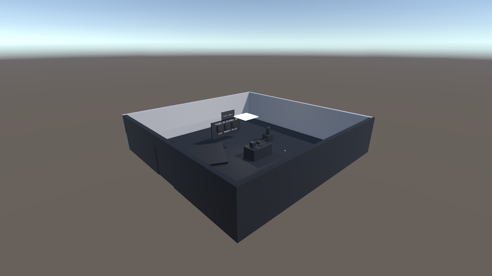
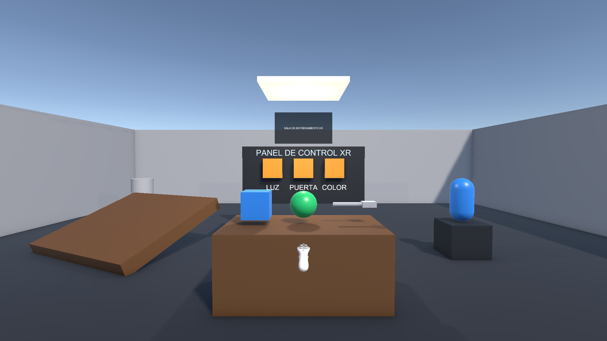
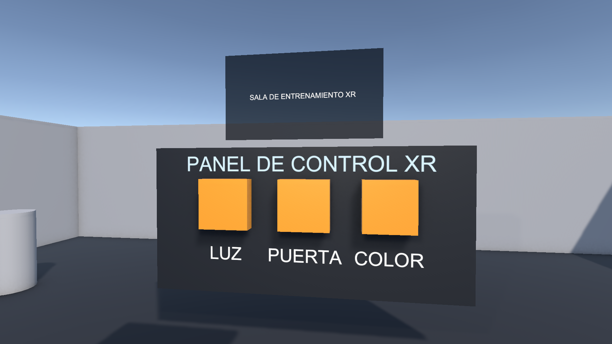
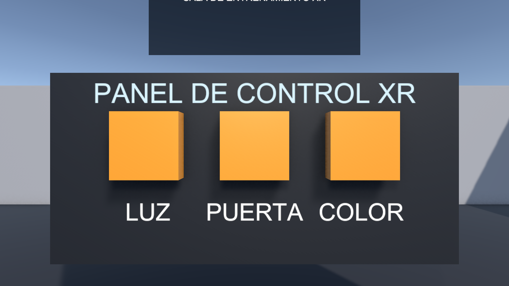
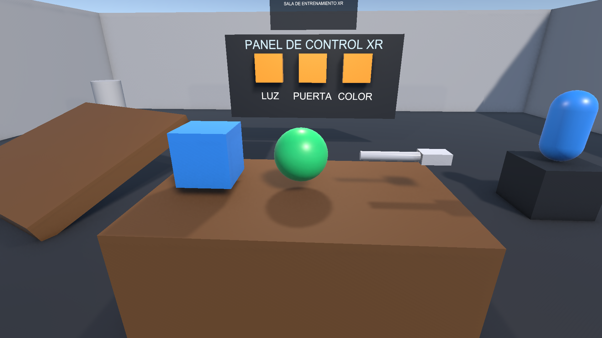
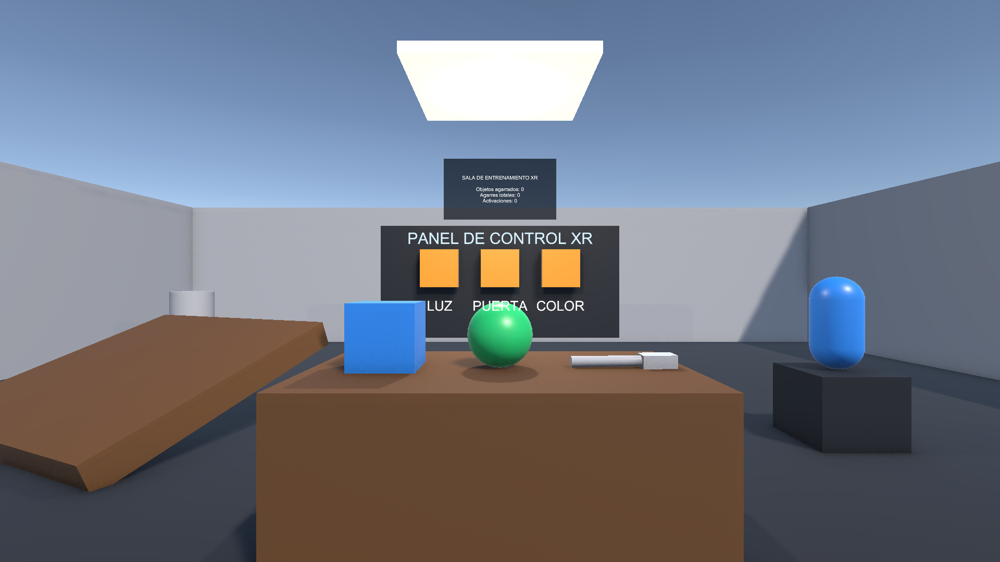

# EC_XR — Reto de Interacción XR (Unity · URP · XR Interaction Toolkit)

Experiencia interactiva de realidad extendida desarrollada en Unity como parte de la
**Evaluación de Conocimientos (EC)** del curso *Laboratorio de Realidad Extendida (XR) para Videojuegos*.

---

## Datos del estudiante

| Campo | Valor |
|---|---|
| **Apellidos y nombres** | Guisado Mora Christopher |
| **Código de estudiante** | 2221898688 |
| **Curso** | Laboratorio de Realidad Extendida (XR) para Videojuegos |
| **Docente** | Victor Alejandro Arroyo Castro |
| **Modalidad** | Individual |
| **Repositorio** | https://github.com/Vanitas-CYB/EC-Guisado-Mora |

---

## Descripción del proyecto

Se construyó una **sala de entrenamiento XR** navegable donde el usuario puede desplazarse,
**agarrar objetos físicos**, **accionar elementos a distancia con un rayo** (encender una luz,
abrir una puerta y cambiar el color de un objeto), **teletransportarse** y observar en una
**interfaz espacial** un contador en vivo de sus interacciones.

El proyecto no depende de un casco de realidad virtual: se incluye el
**XR Interaction Simulator**, que permite manejar el HMD y los dos controladores con
teclado y ratón directamente desde el Editor o una build de Windows.

Escena principal: `Assets/Scenes/EC_XR_GuisadoMoraChristopher.unity`

---

## Funcionalidades implementadas (según la rúbrica)

| Criterio | Puntaje | Cómo se cumple |
|---|---|---|
| **1. Configuración correcta del proyecto XR** | 4 | Unity 6000.3.10f1 + **URP 17.3.0**, **Input System**, **XR Plug-in Management** con **OpenXR** habilitado en Standalone, **XR Interaction Toolkit 3.6.1** y los samples *Starter Assets* y *XR Interaction Simulator*. El proyecto abre y ejecuta sin errores. |
| **2. Construcción del escenario** | 3 | Escena propia `EC_XR_GuisadoMoraChristopher` con **piso**, **cuatro muros** (límites visuales, uno con puerta), **iluminación** (luz direccional + luz puntual) y **más de cinco objetos 3D**: mesa, cubo, esfera, llave (mango + cabeza), cápsula, rampa, columna y pedestal. |
| **3. Manipulación de objetos** | 5 | **Tres objetos agarrables** con `Rigidbody` + `XR Grab Interactable` + `XR General Grab Transformer`: **cubo**, **esfera** y **llave**. Todos con gravedad, masa, lanzamiento al soltar y agarre dinámico. |
| **4. Interacción mediante Ray / UI** | 3 | El rig incluye **XR Ray Interactor** con línea visual en ambos controladores. Con el rayo se accionan tres botones del *Panel de Control*: **LUZ** (`InterruptorLuz`), **PUERTA** (`PuertaDeslizante`) y **COLOR** (`CambiarColorObjetivo`). La **cápsula** también cambia de color al ser apuntada directamente. |
| **5. Funcionalidad adicional (reto libre)** | 2 | **Teletransporte** sobre el piso (`TeleportationArea` + `TeleportationProvider`) y **UI espacial**: un *Canvas* en *World Space* con un **contador en vivo** (`ContadorXR`) de objetos agarrados, agarres totales y activaciones. |
| **6. GitHub público + README + evidencias** | 3 | Repositorio público, este `README.md`, capturas de pantalla y video demostrativo. |

---

## Jerarquía de la escena

```
EC_XR_GuisadoMoraChristopher
├── Escenario
│   ├── Piso_Sala                 (prefab SUELO del proyecto, MeshCollider + TeleportationArea)
│   ├── Muro_Norte / Muro_Sur / Muro_Este / Muro_Oeste_A / Muro_Oeste_B / Dintel_Oeste
│   ├── Hoja_Puerta               (PuertaDeslizante)
│   ├── Marco_Puerta / Marco_Puerta_2
│   └── Panel_Control
│       ├── Tablero
│       ├── Boton_Luz             (XR Simple Interactable + BotonXR -> InterruptorLuz)
│       ├── Boton_Puerta          (XR Simple Interactable + BotonXR -> PuertaDeslizante)
│       ├── Boton_Color           (XR Simple Interactable + BotonXR -> CambiarColorObjetivo)
│       └── Etiquetas 3D
├── Objetos_3D
│   ├── Mesa_Central
│   ├── Cubo_Grabable             (Rigidbody + XRGrabInteractable)
│   ├── Esfera_Grabable           (Rigidbody + XRGrabInteractable)
│   ├── Llave_Grabable            (Rigidbody + XRGrabInteractable, compuesta)
│   ├── Pedestal_Color / Capsula_Color (CambiarColorObjetivo)
│   ├── Rampa_Entrenamiento
│   └── Columna_Decorativa
├── Logica_XR
│   └── Control_Luz               (InterruptorLuz)
├── Luz_Direccional
├── Luz_Puntual_Sala
│   └── Panel_Lampara             (material emisivo que refleja el estado de la luz)
├── XR Interaction Manager
├── EventSystem                   (XRUIInputModule)
├── UI_Espacial                   (Canvas World Space + ContadorXR)
├── XR Origin (XR Rig)            (Starter Assets: cámara, controladores, interactores, locomoción)
└── XR Interaction Simulator      (teclado y ratón sin necesidad de casco)
```

---

## Controles e instrucciones de uso

### Cómo ejecutar

1. Abrir el proyecto con **Unity 6000.3.10f1** (Unity Hub). La primera vez Unity descargará los
   paquetes de XR desde el registro oficial (requiere conexión a internet).
2. Abrir la escena `Assets/Scenes/EC_XR_GuisadoMoraChristopher.unity`.
3. Pulsar **Play**. No se necesita casco: el **XR Interaction Simulator** ya está en la escena.

### Controles del XR Interaction Simulator

| Acción | Tecla / ratón |
|---|---|
| Avanzar / retroceder | `W` / `S` |
| Desplazarse a izquierda / derecha | `A` / `D` |
| Subir / bajar (HMD) | `Q` / `E` |
| Girar la vista | Flechas del teclado, o **botón derecho del ratón** + mover |
| Cambiar de dispositivo activo (HMD / controlador izq. / der.) | `Tab` |
| Manipular el controlador izquierdo / derecho | `[` / `]` |
| Manipular solo la cabeza | `H` |
| **Apuntar el controlador** | Mover el ratón (*point & click*, activo por defecto) |
| **Agarrar / seleccionar** | **Mantener clic izquierdo** (o `G` = grip) |
| **Activar botones y el rayo** | **Mantener `T`** (trigger) |
| Botones primario / secundario | `1` / `2` |
| Joystick del controlador | `I` `J` `K` `L` |
| Reiniciar la posición del dispositivo | `R` |
| Menú de ayuda del simulador | `X` / `Y` |

### Guion sugerido para probar cada funcionalidad

1. **Mirar alrededor**: mover el ratón (botón derecho) y usar las flechas.
2. **Caminar**: `W A S D`; subir o bajar la vista con `Q` / `E`.
3. **Agarrar objetos**: apuntar con el ratón al **cubo**, la **esfera** o la **llave** y
   mantener el **clic izquierdo**; mover el ratón para trasladarlos y soltar para lanzarlos.
4. **Interacción a distancia**: apuntar al **Panel de Control** y, con `T`, accionar
   **LUZ** (apaga/enciende la lámpara), **PUERTA** (abre/cierra la puerta deslizante) y
   **COLOR** (cambia el color de la cápsula). También se puede apuntar directamente a la
   **cápsula azul** y activarla para cambiar su color.
5. **Teletransporte**: apuntar con el rayo al piso y mantener `T`; al soltar, el jugador se
   desplaza al punto marcado.
6. **UI espacial**: observar el panel flotante, que actualiza en vivo los contadores de
   objetos agarrados, agarres totales y activaciones.

---

## Evidencias (capturas)

### 1. Vista general del escenario


### 2. Escena desde la posición del jugador


### 3. Panel de control e interfaz espacial


### 4. Detalle de los botones de interacción por rayo


### 5. Objetos manipulables (Rigidbody + XR Grab Interactable)


### 6. Ejecución en Play con los componentes XR activos


> Captura tomada durante el **Play** desde la cámara del XR Origin, con el contador de la
> UI espacial visible (*objetos agarrados, agarres totales y activaciones*).

### 7. Configuración XR y componentes en el Inspector — *pendiente de captura*

> Guardar como `Capturas/07_inspector_configuracion_xr.png`: captura del Inspector con el
> `XR Origin (XR Rig)`, el `XR Interaction Manager`, el `XR Interaction Simulator` y/o la ventana
> **Project Settings > XR Plug-in Management** con **OpenXR** habilitado.

---

## Video demostrativo

🎬 **Enlace al video (máximo 1 minuto):** `PENDIENTE — pegar aquí el enlace de YouTube / Drive`

> Guion recomendado (60 s): 1) vista general de la sala · 2) agarrar y lanzar el cubo y la esfera ·
> 3) apuntar con el rayo al panel y encender/apagar la luz · 4) abrir la puerta ·
> 5) cambiar el color de la cápsula · 6) teletransportarse · 7) mostrar el contador de la UI espacial.

---

## Tecnologías y paquetes utilizados

| Elemento | Versión |
|---|---|
| Unity Editor | **6000.3.10f1** |
| Universal Render Pipeline (URP) | 17.3.0 |
| XR Interaction Toolkit | 3.6.1 |
| XR Plug-in Management | 4.6.1 |
| OpenXR Plugin | 1.18.0 |
| Input System | 1.18.0 |
| uGUI | 2.0.0 |
| XR Core Utils | 2.5.3 |
| Plataforma de prueba | Windows Standalone (DirectX 11) |
| Samples importados | *Starter Assets* y *XR Interaction Simulator* |

### Scripts propios

| Script | Ubicación | Función |
|---|---|---|
| `InterruptorLuz.cs` | `Assets/Scripts` | Enciende y apaga una o varias luces y actualiza la emisión de sus materiales. |
| `PuertaDeslizante.cs` | `Assets/Scripts` | Abre y cierra una puerta desplazando su hoja, con sonido y antirrebote. |
| `CambiarColorObjetivo.cs` | `Assets/Scripts` | Recorre una paleta de colores sobre uno o varios renderers. |
| `BotonXR.cs` | `Assets/Scripts` | Conecta un `XR Simple Interactable` con un método de otro componente (interacción a distancia). |
| `ContadorXR.cs` | `Assets/Scripts` | Contabiliza agarres y activaciones y los muestra en la UI espacial. |

### Herramientas de automatización incluidas (Editor)

En el menú superior **`EC_XR`** del Editor se incluyen utilidades que documentan y reproducen
la configuración del proyecto:

| Menú | Descripción |
|---|---|
| `EC_XR / 0. Importar samples de XR Interaction Toolkit` | Copia los samples necesarios desde la caché de paquetes. |
| `EC_XR / 1. Construir escena XR` | Reconstruye por completo la escena de la evaluación. |
| `EC_XR / 2. Habilitar OpenXR en XR Plug-in Management` | Activa el proveedor OpenXR para Standalone. |
| `EC_XR / 3. Verificar escena XR` | Comprueba los requisitos de la rúbrica y escribe `Logs/EC_XR_verificacion.log`. |
| `EC_XR / 4. Capturar evidencias de la escena` | Genera las capturas de `Capturas/`. |
| `EC_XR / 9. Ejecutar todo` | Ejecuta el flujo completo (escena + XR + verificación). |

Resultado de la última verificación automática:

```
[OK] XR Plug-in Management: OpenXR habilitado en Standalone = True
[OK] XR Interaction Manager (esperado: >=1)
[OK] XR Origin (esperado: presente)
[OK] XR Interaction Simulator (esperado: presente)
[OK] Luces (esperado: >=2 (hay 2))
[OK] Objetos 3D con malla (esperado: >=5)
[OK] Piso (prefab SUELO) (esperado: >=1)
[OK] Muros / limites visuales (esperado: >=4)
[OK] XR Grab Interactable (esperado: >=2 (hay 3))
[OK] Rigidbody en agarrables (esperado: todos)
[OK] XR Simple Interactable (botones de rayo) (esperado: >=1 (hay 4))
[OK] Script InterruptorLuz / PuertaDeslizante / CambiarColorObjetivo
[OK] Teletransporte (TeleportationArea) (esperado: >=1)
[OK] UI espacial (Canvas World Space) (esperado: >=1)
[OK] Script ContadorXR
=== RESULTADO: TODO CORRECTO ===
```

---

## Estructura del repositorio

```
EC-Guisado-Mora/
├── Assets/
│   ├── Editor/            Herramientas de configuración, verificación y captura
│   ├── Materiales/        Materiales URP del escenario
│   ├── Samples/           Samples de XR Interaction Toolkit (Starter Assets, Simulator)
│   ├── Scenes/            EC_XR_GuisadoMoraChristopher.unity
│   ├── Scripts/           Scripts de interacción propios
│   ├── Escenario/         Prefabs de muros del estudiante
│   └── SUELO.prefab       Prefab de piso del estudiante
├── Capturas/              Evidencias en imagen
├── Packages/              manifest.json y packages-lock.json
├── ProjectSettings/       Configuración del proyecto (incluye XR y escenas de build)
├── .gitignore             Exclusiones de Unity
└── README.md
```

Las carpetas `Library/`, `Temp/`, `Logs/`, `obj/` y `UserSettings/` no se versionan
(generadas por Unity y excluidas en `.gitignore`).

---

## Notas sobre la configuración XR

- **XR Plug-in Management**: proveedor **OpenXR** habilitado para *Standalone (PC)*.
  Al no haber un runtime OpenXR instalado en el equipo de desarrollo, la experiencia se
  valida con el **XR Interaction Simulator**, que crea dispositivos XR simulados a través
  del Input System sin requerir casco.
- El componente **XR Interaction Simulator** resuelve automáticamente la cámara, los dos
  controladores y su *device lifecycle manager* a partir del `XR Origin (XR Rig)`.
- Los materiales de los modelos del rig usan el shader del pipeline integrado; el script de
  construcción los convierte automáticamente a **URP Lit** para evitar el color magenta.

---

*Proyecto académico — Universidad Autónoma del Perú · Facultad de Ingeniería y Arquitectura · Ingeniería de Software.*
